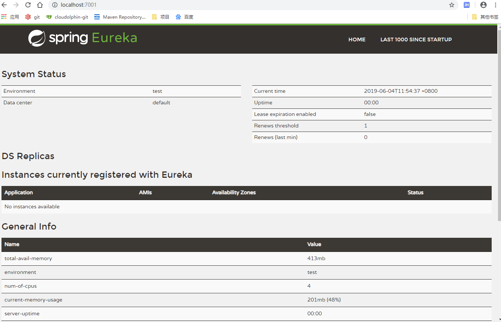
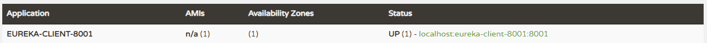
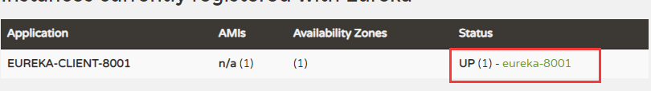
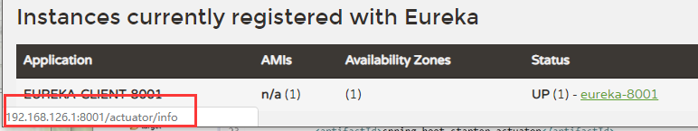
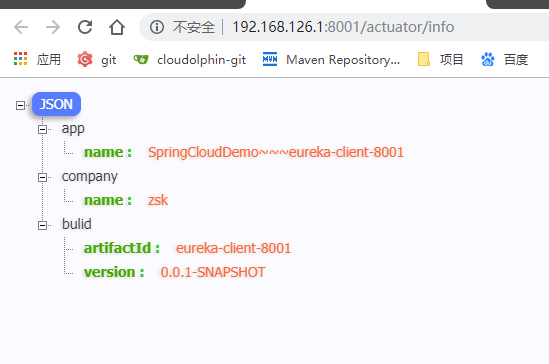

# SpringCloudDemo #
Simple study notes for springcloud

## 1 目录结构 ##
    -SpringCloudDemo
    --- 1-db ：存放数据库文件
    --- 2-image ：存放图片文件
    --- common-api ：公共模块
    --- consumer-dept-8002 ：基础例子，没有使用组件
    --- provider-dept-8001 ：基础例子没有使用组件
    --- eureka-server-7001 ：eureka服务端
## 2 目录说明 ##
- ***因为牵涉到消费者，服务者等相关内容，每次测试可能会牵涉多个模块，这里分组介绍***。
### 2.1 公共模块 ###
#### 2.1.1 common-api ####
##### a.说明 ##### 
   - 公共模块，目前提供了公共实体类。
### 2.2 简单的调用 ###
- ***注意：本组未使用springcloud相关组件。***
#### 2.2.1 consumer-dept-8002 ####
- 基础模块，为以后集成springcloud组件做准备,需要时可以直接从这个模块拷贝东西，例如：service层等。
#### 2.2.2 provider-dept-8002 ####
- 基础模块，为以后集成springcloud组件做准备，需要时可以直接从这个模块拷贝东西，例如：service层等。
### 2.3 eureka ###
- ***模块说明：使用eureka进行服务注册与发现***
#### 2.3.1 eureka-server-7001:服务注册 ####
##### a.说明 #####
- 用于eureka的服务注册管理
##### b.注意事项 #####
    1. 注意版本的对应关系，建议使用父pom集中管理版本信息。
    2. 有些模块用不到有关数据库的相关信息（例如：服务消费者），需要手动关闭springboot的数据库的自动装载。并且尽量不要导入多余的包
        (例如：有关使用druid的包)，否则有些包也会自动去寻找配置文件中的相关信息，项目启动就会报错。
##### c.实现方式 #####
1. pom文件增加依赖
```
<dependency>
    <groupId>org.springframework.cloud</groupId>
    <artifactId>spring-cloud-starter-netflix-eureka-server</artifactId>
</dependency> 
```
2. 主启动类增加注解:`@EnableEurekaServer`
3. yml配置文件(这里只写增加的配置代码，其他的代码，如：spring的相关配置，数据库的相关配置省略不写。下同)：
```
server:
  port: 7001
eureka:
  instance:
    hostname: localhost #erueka服务端的实例名称
  client:
    register-with-eureka: false #false表示不向注册中心注册自己
    fetch-registry: false #false表示自己端就是注册中心，我的职责是维护服务实例，不需要去检索服务
    service-url:
      defaultZone: http://${eureka.instance.hostname}:${server.port}/eureka/
```
##### d.测试启动 #####
1. 启动本地项目
2. 然后，在浏览器中输入：`localhost:7001`
3. 然后会打开eureka的管理页面：


#### 2.3.2 eureka-client-8001 ####
##### a.说明 #####
- 模拟eureka的服务提供者，将服务注册到服务注册服务器中。
##### b.注意事项 #####

##### c.实现方法 #####
1. pom文件增加依赖
```
 <dependency>
            <groupId>org.springframework.cloud</groupId>
            <artifactId>spring-cloud-starter-netflix-eureka-server</artifactId>
        </dependency>

        <dependency>
            <groupId>org.springframework.cloud</groupId>
            <artifactId>spring-cloud-starter-config</artifactId>
        </dependency>
```
2. 主启动类增加注解:`@EnableEurekaClient`
3. yml文件增加：
```
eureka:
  client:
    service-url:
      defaultZone: http://localhost:7001/eureka
```
***别忘了还要在yml文件中增加：***
```
spring:
  application:
    name: eureka-client-8001
```
***这个用来标识该微服务的名称，很重要！很重要！***
##### d.测试 #####
1. 启动eureka-server-7001模块，然后启动本模块
2. 然后，在浏览器中输入：`localhost:7001`
3. 然后会打开eureka的管理页面，会增加一个消费提供者：


##### e.信息完善 #####
1. yml文件增加(为了表明具体位置，这里是全部的yml，增加的内容对比上面的自己补充)：
```
eureka:
  client:
    service-url:
      defaultZone: http://localhost:7001/eureka
  instance:
    instance-id: eureka-8001 #可以给本服务起别名
```
作用：


2. yml文件增加(为了表明具体位置，这里是全部的yml，增加的内容对比上面的自己补充)：
```
eureka:
  client:
    service-url:
      defaultZone: http://localhost:7001/eureka
  instance:
    instance-id: eureka-8001 #可以给本服务起别名
    prefer-ip-address: true #访问路径可以显示ip地址
```
作用：


3. 完善微服务info信息
   1. 首先在本模块pom文件增加：
   ```
    <!--actuator监控信息完善-->
        <dependency>
            <groupId>org.springframework.boot</groupId>
            <artifactId>spring-boot-actuator</artifactId>
        </dependency>
   ```
   2. 在父的pom文件添加bulid。这里简单解释一下:就是用maven的这个插件去解析src/main/resources中以$开头和结尾的东西。
   ```
   <build>
        <finalName>SpringCloudDemo</finalName>
        <resources>
            <resource>
                <directory>src/main/resources</directory>
                <filtering>true</filtering>
            </resource>
        </resources>
        <plugins>
            <plugin>
                <groupId>org.apache.maven.plugins</groupId>
                <artifactId>maven-resources-plugin</artifactId>
                <configuration>
                    <delimiters>
                        <delimiter>$</delimiter>
                    </delimiters>
                </configuration>
            </plugin>
        </plugins>
    </build>
   ```
   3. 在本模块的yml文件中增加：
   ```
   info:
      app.name: SpringCloudDemo~~~eureka-client-8001
      company.name: zsk
      bulid.artifactId: $project.artifactId$
      bulid.version: $project.version$
   ```
   *说明：上面的app.name和conpany.name在本例中是写死了，而bulid.artifactId和 bulid.version配合父pom文件的bulid标签内容，自动解析*
最终结果：


##### f.eureka自我保护 #####
    总结：某个时刻某一个微服务不可用了，eureka不会立刻清理，依旧会对该微服务信息进行保存。
    手动禁止(不推荐)：eureka.server.enable-self-preservation: false
