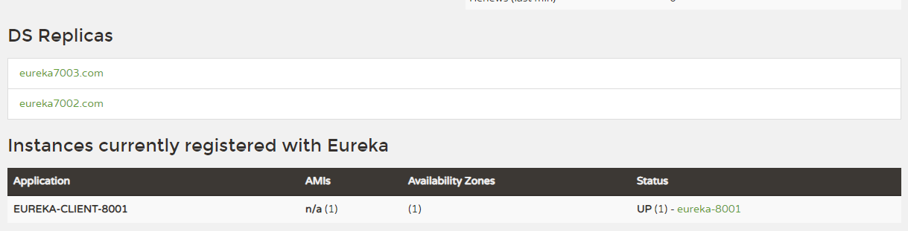
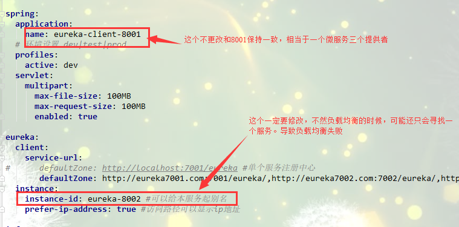
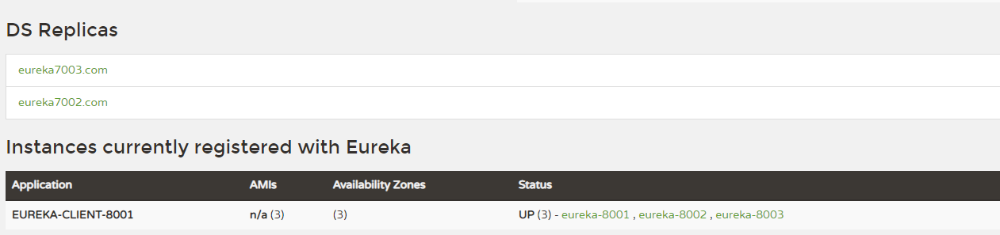
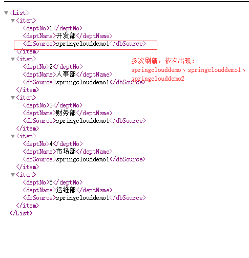
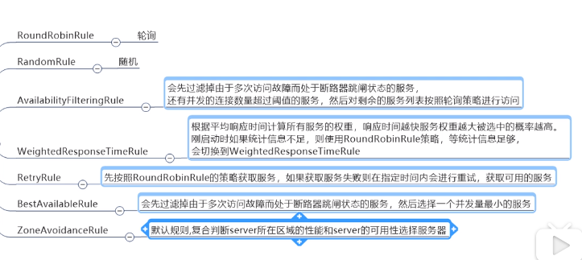
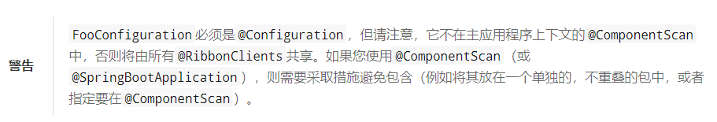

# SpringCloudDemo #
Simple study notes for springcloud  
- 说明方式，（以eureka为例）：  
     2.3 eureka（主要的技术）    
        模块说明：XXXXXX。（简单介绍使用哪些模块）  
    2.3.1 XXX模块（下面开始对模块的详细介绍）   
      a.说明  
      （对该模块的说明）  
      b.注意事项  
        （过程中需要注意的地方。）  
      c.实现方式（具体实现方式）   
        1. XXXX  
        2. XXXX  
        。。。  
      d.测试启动（如何测试）   
       1. XXXX  
       2. XXXX  
       。。。  
      e.其他（其他额外需要的地方）  
     

## 1 目录结构 ##
    -SpringCloudDemo
    --- 1-db ：存放数据库文件
    --- 2-image ：存放图片文件
    --- common-api ：公共模块
    --- consumer-dept-8002 ：基础例子，没有使用组件
    --- provider-dept-8001 ：基础例子，没有使用组件
    --- eureka-server-7001 ：eureka服务注册中心
    --- eureka-client-8001 ：eureka服务注册
    --- eureka-server-7002 ：配合eureka-server-7001实现服务注册中心的集群
    --- eureka-server-7003 ：配合eureka-server-7001实现服务注册中心的集群
    --- consumer-ribbon-9001 ：集成ribbon，实现简单的负载均衡
    --- eureka-client-8002 ：配合eureka-client-8001实现多个微服务的运行，可用于负载均衡的测试
    --- eureka-client-8003 ：配合eureka-client-8001实现多个微服务的运行，可用于负载均衡的测试
    --- consumer-ribbon-9002 ：集成ribbon，实现自定义负载均衡算法
    --- consumer-feign-9003 : 集成了feign模块

## 2 目录说明 ##
- ***因为牵涉到消费者，服务者等相关内容，每次测试可能会牵涉多个模块，这里分组介绍***。
### 2.1 公共模块 ###
#### 2.1.1 common-api ####
##### a.说明 ##### 
   - 公共模块，目前提供了公共实体类。
### 2.2 简单的调用 ###
- ***注意：本组未使用springcloud相关组件。***
#### 2.2.1 consumer-dept-8002 ####
- 基础模块，为以后集成springcloud组件做准备,需要时可以直接从这个模块拷贝东西，例如：service层等。
#### 2.2.2 provider-dept-8002 ####
- 基础模块，为以后集成springcloud组件做准备，需要时可以直接从这个模块拷贝东西，例如：service层等。
### 2.3 eureka ###
- ***模块说明：使用eureka进行服务注册与发现***
#### 2.3.1 eureka-server-7001:服务注册 ####
##### a.说明 #####
- 用于eureka的服务注册管理
##### b.注意事项 #####
    1. 注意版本的对应关系，建议使用父pom集中管理版本信息。
    2. 有些模块用不到有关数据库的相关信息（例如：服务消费者）,所以也不会有数据库的相关配置信息。此时需要手动关闭springboot的数据库的自动装载。并且尽量不要导入多余的包
        (例如：有关使用druid的包)，否则有些包也会自动去寻找配置文件中的相关信息，然后找不到，项目启动就会报错。
##### c.实现方式 #####
1. pom文件增加依赖
```
<dependency>
    <groupId>org.springframework.cloud</groupId>
    <artifactId>spring-cloud-starter-netflix-eureka-server</artifactId>
</dependency> 
```
2. 主启动类增加注解:`@EnableEurekaServer`
3. yml配置文件(这里只写增加的配置代码，其他的代码，如：spring的相关配置，数据库的相关配置省略不写。下同)：
```
server:
  port: 7001
eureka:
  instance:
    hostname: localhost #erueka服务端的实例名称
  client:
    register-with-eureka: false #false表示不向注册中心注册自己
    fetch-registry: false #false表示自己端就是注册中心，我的职责是维护服务实例，不需要去检索服务
    service-url:
      defaultZone: http://${eureka.instance.hostname}:${server.port}/eureka/
```
##### d.测试启动 #####
1. 启动本地项目
2. 然后，在浏览器中输入：`localhost:7001`
3. 然后会打开eureka的管理页面：


#### 2.3.2 eureka-client-8001 ####
##### a.说明 #####
- 模拟eureka的服务提供者，将服务注册到服务注册服务器中。
##### b.注意事项 #####

##### c.实现方法 #####
1. pom文件增加依赖
```
 <dependency>
    <groupId>org.springframework.cloud</groupId>
    <artifactId>spring-cloud-starter-netflix-eureka-server</artifactId>
</dependency>

<dependency>
    <groupId>org.springframework.cloud</groupId>
    <artifactId>spring-cloud-starter-config</artifactId>
</dependency>
```
2. 主启动类增加注解:`@EnableEurekaClient`
3. yml文件增加：
```
eureka:
  client:
    service-url:
      defaultZone: http://localhost:7001/eureka
```
***别忘了还要在yml文件中增加：***
```
spring:
  application:
    name: eureka-client-8001
```
***这个用来标识该微服务的名称，很重要！很重要！***
##### d.测试 #####
1. 启动eureka-server-7001模块，然后启动本模块
2. 然后，在浏览器中输入：`localhost:7001`
3. 然后会打开eureka的管理页面，会增加一个消费提供者：


##### e.信息完善 #####
1. yml文件增加(为了表明具体位置，这里是全部的yml，增加的内容对比上面的自己补充)：
```
eureka:
  client:
    service-url:
      defaultZone: http://localhost:7001/eureka
  instance:
    instance-id: eureka-8001 #可以给本服务起别名
```
作用：


2. yml文件增加(为了表明具体位置，这里是全部的yml，增加的内容对比上面的自己补充)：
```
eureka:
  client:
    service-url:
      defaultZone: http://localhost:7001/eureka
  instance:
    instance-id: eureka-8001 #可以给本服务起别名
    prefer-ip-address: true #访问路径可以显示ip地址
```
作用：


3. 完善微服务info信息
   1. 首先在本模块pom文件增加：
   ```
    <!--actuator监控信息完善-->
        <dependency>
            <groupId>org.springframework.boot</groupId>
            <artifactId>spring-boot-actuator</artifactId>
        </dependency>
   ```
   2. 在父的pom文件添加bulid。这里简单解释一下:就是用maven的这个插件去解析src/main/resources中以$开头和结尾的东西。
   ```
   <build>
        <finalName>SpringCloudDemo</finalName>
        <resources>
            <resource>
                <directory>src/main/resources</directory>
                <filtering>true</filtering>
            </resource>
        </resources>
        <plugins>
            <plugin>
                <groupId>org.apache.maven.plugins</groupId>
                <artifactId>maven-resources-plugin</artifactId>
                <configuration>
                    <delimiters>
                        <delimiter>$</delimiter>
                    </delimiters>
                </configuration>
            </plugin>
        </plugins>
    </build>
   ```
   3. 在本模块的yml文件中增加：
   ```
   info:
      app.name: SpringCloudDemo~~~eureka-client-8001
      company.name: zsk
      bulid.artifactId: $project.artifactId$
      bulid.version: $project.version$
   ```
   *说明：上面的app.name和conpany.name在本例中是写死了，而bulid.artifactId和 bulid.version配合父pom文件的bulid标签内容，自动解析*
最终结果：


##### f.eureka自我保护 #####
    总结：某个时刻某一个微服务不可用了，eureka不会立刻清理，依旧会对该微服务信息进行保存。
    手动禁止(不推荐)：eureka.server.enable-self-preservation: false

***目前有的疑问：服务注册中心有了，服务注册有了（服务提供方），服务消费方怎么消费？服务提供方怎么控制服务的暴露（dubbo可以控制具体哪些方法暴露）？***

#### 2.3.4 eureka服务注册中心集群 ####
* 使用的模块有：eureka-server-7001 ，eureka-server-7002，eureka-server-7003
  同时为了测试方便在本机的hosts文件修改了ip映射：
  添加了：
  ```
  127.0.0.1 eureka7001.com  
  127.0.0.1 eureka7002.com  
  127.0.0.1 eureka7003.com  
  ```
*
1. 修改各个模块的yml文件，以7001为例,其他的类比，port，hostname，和defaultZone需要修改：
```
#7001集群
server:
  port: 7001
eureka:
  instance:
    hostname: eureka7001.com #erueka服务端的实例名称
  client:
    register-with-eureka: false #false表示不向注册中心注册自己
    fetch-registry: false #false表示自己端就是注册中心，我的职责是维护服务实例，不需要去检索服务
    service-url:
      defaultZone: http://eureka7002.com:7002/eureka/,http://eureka7003.com:7003/eureka/
```
```
#7002集群
server:
  port: 7002
eureka:
  instance:
    hostname: eureka7002.com #erueka服务端的实例名称
  client:
    register-with-eureka: false #false表示不向注册中心注册自己
    fetch-registry: false #false表示自己端就是注册中心，我的职责是维护服务实例，不需要去检索服务
    service-url:
      defaultZone: http://eureka7001.com:7001/eureka/,http://eureka7003.com:7003/eureka/

```
```
#7003集群
server:
  port: 7003
eureka:
  instance:
    hostname: eureka7003.com #erueka服务端的实例名称
  client:
    register-with-eureka: false #false表示不向注册中心注册自己
    fetch-registry: false #false表示自己端就是注册中心，我的职责是维护服务实例，不需要去检索服务
    service-url:
      defaultZone: http://eureka7001.com:7001/eureka/,http://eureka7002.com:7002/eureka/
```
2. 7001和7002和7003，主启动类的注解和7001一样
3. 修改eureka-client-8001模块的yml
```
defaultZone: http://erureka7001.com:7001/eureka/,http://erureka7001.com:7002/eureka/,http://erureka7001.com:7003/eureka/  #集群服务注册中心
```
4. 浏览器输入：`http://eureka7001.com`，同时也能查看其它两个运行情况，`http://eureka7002.com`或者`http://eureka7003.com`。例如：eureka7001运行结果


### 2.4 ribbon的集成 ###
* 使用的模块：consumer-ribbon-9001 ,consumer-ribbon-9002*
#### 2.4.1 consumer-ribbon-9001 ####
#### 使用ribbon默认负载均衡算法（轮询算法）####
- 说明：本次使用ribbon的默认轮询算法，使用模块eureka-client-8001，eureka-client-8002，eureka-client-8003。辅助测试负载均衡效果
##### a.说明 #####
1. 测试负载均衡时需要多个微服务提供者，这里仿照eureka-client-8001，新建两个服务提供者模块分别是eureka-client-8002和eureka-client-8003。
2. 同时为了区分不同的微服务，8002和8003分别访问springcloudde1和springclouddemo2数据库。（dept表中db_source字段不一样，用于区分不同的微服务查询的结果）
3. 修改8002和8003模块的相关信息。主要包括：
***端口号，数据库名称，instance-id***,按照8002为例，如图：


##### b.注意事项 #####

##### c.实现方法 #####
1. pom文件（因为需要和eureka集成，所以这里将所有的jar包都放进去了），
```
 <!--自定义的公共模块-->
        <dependency>
            <groupId>cn.zsk</groupId>
            <artifactId>common-api</artifactId>
            <version>${common-api.version}</version>
        </dependency>

        <dependency>
            <groupId>org.springframework.cloud</groupId>
            <artifactId>spring-cloud-starter-netflix-eureka-server</artifactId>
        </dependency>

        <dependency>
            <groupId>org.springframework.cloud</groupId>
            <artifactId>spring-cloud-starter-config</artifactId>
        </dependency>

        <!--Ribbon -->
        <dependency>
            <groupId>org.springframework.cloud</groupId>
            <artifactId>spring-cloud-starter-netflix-ribbon</artifactId>
        </dependency>
```
2. yml 文件
```
server:
  port: 9001


eureka:
  client:
    register-with-eureka: false
    service-url:
      defaultZone: http://eureka7001.com:7001/eureka/,http://eureka7002.com:7002/eureka/,http://eureka7003.com:7003/eureka/
```
3. 主启动类注解
```
@SpringBootApplication(exclude = {
        DataSourceAutoConfiguration.class,
        DataSourceTransactionManagerAutoConfiguration.class,
        HibernateJpaAutoConfiguration.class
})
@EnableEurekaClient
```
4. 在ConfigBean中getRestTemplate方法增加注解`@LoadBalanced`
```
    @Bean
    @LoadBalanced
    public RestTemplate getRestTemplate(){
        return new RestTemplate();
    }
```
##### d.测试 #####
1. 启动eureka-server-7001，eureka-server-7002，eureka-server-7003
2. 启动eureka-client-8001，eureka-client-8002，eureka-client-8003
此时如图


3. 启动consumer-ribbon-9001模块
4. 打开浏览器，输入`localhost:9001/consumer/dept/list`,多次刷新，可查看到返回的结果是不同数据库的内容


5. 如果多次刷新db_resouce字段依次出现不同的的值，说明查询的时候访问的不同的数据库，即访问了不同的微服务，实现了轮询方式的负载均衡

#### 使用ribbon其他算法（ribbon自带的，不是自定义的） ####
- 只需要在ConfigBean中增加一个配置就行了,例如改用随机算法：
```
    @Bean
    @LoadBalanced
    public RestTemplate getRestTemplate(){
        return new RestTemplate();
    }

    /*
     * 如果不定义这个myRule（）方法，默认使用轮询算法。
     * 现在使用重新选择的随机算法代替原来的轮询算法
     * */
    @Bean
    public IRule myRule(){
        return new RandomRule();
    }
```
其他算法介绍，如图：


#### 2.4.2 consumer-ribbon-9002 ####
##### a.说明 #####
***本模块主要演示自定义ribbon负载均衡算法，同时本次的例子中，是简单的demo，例如自定义算法时的变量不是线程安全的，如果投入生产，请修改！！！***
##### b.注意事项 #####

##### c.实现方式 #####
1. pom文件
```
 <!--自定义的公共模块-->
        <dependency>
            <groupId>cn.zsk</groupId>
            <artifactId>common-api</artifactId>
            <version>${common-api.version}</version>
        </dependency>

        <dependency>
            <groupId>org.springframework.cloud</groupId>
            <artifactId>spring-cloud-starter-netflix-eureka-server</artifactId>
        </dependency>

        <dependency>
            <groupId>org.springframework.cloud</groupId>
            <artifactId>spring-cloud-starter-config</artifactId>
        </dependency>

        <!--Ribbon -->
        <dependency>
            <groupId>org.springframework.cloud</groupId>
            <artifactId>spring-cloud-starter-netflix-ribbon</artifactId>
        </dependency>
```
2. yml配置
```
server:
  port: 9002


eureka:
  client:
    register-with-eureka: false
    service-url:
      defaultZone: http://eureka7001.com:7001/eureka/,http://eureka7002.com:7002/eureka/,http://eureka7003.com:7003/eureka/

```
3. 主启动类,增加了`@RibbonClient`注解，注解中的参数分别是微服务的名称，以及自定义算法配置类，（*注意是配置类，不是算法类*）
```
@SpringBootApplication(exclude = {
        DataSourceAutoConfiguration.class,
        DataSourceTransactionManagerAutoConfiguration.class,
        HibernateJpaAutoConfiguration.class
})
@EnableEurekaClient
//在启动该微服务的时候就能去加载我们自定义的Ribbon配置类，从而使配置生效
@RibbonClient(name = "EUREKA-CLIENT-8001",configuration = MyRuleConfig.class)
public class ConsumerRibbon9002Application {

    public static void main(String[] args) {
        SpringApplication.run(ConsumerRibbon9002Application.class, args);
    }

}
```
4. 创建配置类，注意配置类的创建位置。主启动类的包信息是`package cn.zsk.ribbon9002;`，
说明新建的配置类不能放在`ribbon9002`这个包下,以及这个包的子包中。这里新建了一个包：`cn.zsk.ribbon.myrule;`。
官网上的一些说明：


新建的配置类,MyRule()是自定义的算法：
```
@Configuration
public class MyRuleConfig {

    @Bean
    public IRule myRule(){
        return new MyRule();
    }
}

```

5. 自定义算法MyRule()类的创建，（这里建议可以去github上看一下源码，按照需求修改）。当前的需求：使用轮询算法，但是每个微服务执行五次，然后再次轮询。
大体是拷贝github源码，主要的修改代码
```
 if(total < 5){
    server = upList.get(index);
    total ++;
}else {
    total = 0 ;
    index ++;
    if(index >= upList.size()){
        index =0;
    }
}

```
##### d.测试 #####
1. 启动eureka-server-7001，eureka-server-7002，eureka-server-7003
2. 启动eureka-client-8001，eureka-client-8002，eureka-client-8003
3. 启动consumer-ribbon-9002模块
4. 打开浏览器，输入`localhost:9002/consumer/dept/list`,多次刷新，可查看到返回的结果是不同数据库的内容,并且每5次才会换一个微服务

### 2.5 feign ###
    主要使用的模块：consumer-feign-9003。修改了common-api模块，增加了service层并且在该层增加了一个类。
#### 2.5.1 consumer-feign-9003 ####
##### a.说明 #####
- 使用feign实现接口化编程 
- feign默认使用了ribbon的轮询方式的负载均衡，本例中并没有集成feign+ribbon的自定义负载均衡
##### b.注意事项 #####
  
##### c.实现方式 #####
1. pom文件
```
  <!--自定义的公共模块-->
    <dependency>
        <groupId>cn.zsk</groupId>
        <artifactId>common-api</artifactId>
        <version>${common-api.version}</version>
    </dependency>
    
    <dependency>
        <groupId>org.springframework.cloud</groupId>
        <artifactId>spring-cloud-starter-netflix-eureka-server</artifactId>
    </dependency>
    
    <dependency>
        <groupId>org.springframework.cloud</groupId>
        <artifactId>spring-cloud-starter-config</artifactId>
    </dependency>
    
    
    <!--feign-->
    <dependency>
        <groupId>org.springframework.cloud</groupId>
        <artifactId>spring-cloud-starter-openfeign</artifactId>
    </dependency>
``` 
2. yml文件
```
server:
  port: 9003


eureka:
  client:
    register-with-eureka: false
    service-url:
      defaultZone: http://eureka7001.com:7001/eureka/,http://eureka7002.com:7002/eureka/,http://eureka7003.com:7003/eureka/

```
3. 本模块主启动类
```
@SpringBootApplication(exclude = {
        DataSourceAutoConfiguration.class,
        DataSourceTransactionManagerAutoConfiguration.class,
        HibernateJpaAutoConfiguration.class
})
@EnableEurekaClient
@EnableFeignClients(basePackages = {"cn.zsk.api.service"})
```
4. 修改common-api模块
   1. 修改pom
   ```
   <dependency>
            <groupId>com.baomidou</groupId>
            <artifactId>mybatis-plus-boot-starter</artifactId>
        </dependency>
        <!-- lombok -->
        <dependency>
            <groupId>org.projectlombok</groupId>
            <artifactId>lombok</artifactId>
        </dependency>

        <!--feign-->
        <dependency>
            <groupId>org.springframework.cloud</groupId>
            <artifactId>spring-cloud-starter-openfeign</artifactId>
        </dependency>
   ```
   2. 新建cn.zsk.api.service包，然后新建一个类：DeptService.java
   ```
   @FeignClient(value = "EUREKA-CLIENT-8001")
    public interface DeptService {

        @RequestMapping(value = "/dept/get/{id}",method = RequestMethod.GET)
        DeptEntity getByDeptId(@PathVariable("deptId") long deptId);
    
        @RequestMapping(value = "/dept/list",method = RequestMethod.GET)
        List<DeptEntity> list();
    
        @RequestMapping(value = "/dept/add",method = RequestMethod.POST)
        boolean add(DeptEntity deptEntity);
    }
   ```
   3. 说明一下common-api模块新建的DeptService.java。 首先是pom导入有关feign的包。然后加上`@FeignClient`注解，
   `value = "EUREKA-CLIENT-8001`是指明哪个服务。然后`@RequestMapping(value = "/dept/list",method = RequestMethod.GET)`指明的是微服务的访问地址，
   在本例中其实就是eureka-client-7001（或者7002和7003）中的controller中的 `/dept/list`方法。
5. 修改consumer-feign-9003 的controller方法（变回原来熟悉的controller层调用service层了）。注意DeptService是common-api模块的。
```
@Autowired
private DeptService deptService;

 @RequestMapping("list")
 public List<DeptEntity> list(){
    return deptService.list();
   }
```
   
##### d.测试启动 #####  
1. 启动eureka-server-7001，eureka-server-7002，eureka-server-7003
2. 启动eureka-client-8001，eureka-client-8002，eureka-client-8003
3. 启动consumer-feign-9003模块
4. 打开浏览器，输入`localhost:9003/consumer/dept/list`,多次刷新，可查看到返回的结果是不同数据库的内容。而且是轮询方式的。

### 2.6 hystrix ###
#### 2.6.1 hystrix-client-8011 ####   
##### a.说明 #####
- 该模块实现了最简单的熔断例子。存在的问题：失败的处理逻辑和业务代码高度耦合；并且每个业务代码都需要一个相应的fallback方法，造成方法的膨胀。 
##### b.注意事项 #####
1. 注意区分服务熔断和服务降级
   1. *服务熔断是在服务端的*。当服务端某个方法出现问题时，直接返回一个缺省值。通过测试，使用服务熔断时，服务端某个方法出现异常可以返回缺省值，
   但是如果整个服务直接宕机了，调用者还是会出现连接超时。（毕竟服务熔断在服务端，服务端都挂了，熔断也就没有生效了）
   2. *服务降级是在客户端，和服务端没有关系*。当客户端访问服务时，但是出现了问题，比如服务器挂了导致的连接超时，服务器方法执行异常导致没有返回结果进而导致超时等
   情况。客户端会直接调用*本地中fallback方法*，进行相应的处理。
##### c.实现方式 #####
1. pom文件
```
 <!--自定义的公共模块-->
        <dependency>
            <groupId>cn.zsk</groupId>
            <artifactId>common-api</artifactId>
            <version>${common-api.version}</version>
        </dependency>

        <dependency>
            <groupId>com.alibaba</groupId>
            <artifactId>druid-spring-boot-starter</artifactId>
        </dependency>

        <dependency>
            <groupId>mysql</groupId>
            <artifactId>mysql-connector-java</artifactId>
        </dependency>

        <dependency>
            <groupId>org.springframework.cloud</groupId>
            <artifactId>spring-cloud-starter-netflix-eureka-server</artifactId>
        </dependency>

        <dependency>
            <groupId>org.springframework.cloud</groupId>
            <artifactId>spring-cloud-starter-config</artifactId>
        </dependency>

        <!--actuator监控信息完善-->
        <dependency>
            <groupId>org.springframework.boot</groupId>
            <artifactId>spring-boot-actuator</artifactId>
        </dependency>

        <!--hystrix-->
        <dependency>
            <groupId>org.springframework.cloud</groupId>
            <artifactId>spring-cloud-starter-netflix-hystrix</artifactId>
        </dependency>
``` 
2. yml 文件,没有特殊的修改，和eureka-client-8001一样。（为了区分不同的项目，端口号还是需要修改的）
3. 主启动类添加注解`@EnableCircuitBreaker`
4. controller层修改方法(这里列举出启动一个测试方法)
```
    @GetMapping("/list")
    //一旦调用服务失败，并抛出错误信息，会自动调动processHystrix_GetList方法
    @HystrixCommand(fallbackMethod = "processHystrix_List")
    public List<DeptEntity> list(){
        if(true){
            throw  new RuntimeException("***********模拟异常了************");
        }
        return deptService.list();
    }

   public List<DeptEntity> processHystrix_List(){
        DeptEntity deptEntity = new DeptEntity();
        deptEntity.setDeptNo(0L).setDeptName("异常了，这个是熔断器返回的假的信息").setDbSource("hystrix");
        List<DeptEntity> deptEntityList = new ArrayList<>();
        deptEntityList.add(deptEntity);
        return deptEntityList;
   }
```
##### d.测试启动 #####
1. 启动eureka-server-7001，eureka-server-7002，eureka-server-7003
2. 启动hystrix-client-8011
3. 启动consumer-feign-9003模块
4. 打开浏览器，输入`localhost:9003/consumer/dept/list`,会返回当出现异常后自定义的信息
5. 如果此时停止了hystrix-client-8011，然后再次刷新，就会出现错误页面。下面的服务降级将会解决这个问题。

#### 2.6.2 hystrix-client-8012 ####   
##### a.说明 #####
1. 本模块测试服务降级
   1. 由于服务降级只是客户端，和服务端无关。本模块将有关服务熔断的相关内容删除了(其实目前本模块和eureka-client-8001一样的，为了测试区分就拷贝了一份)。
   2. 本次的测试牵涉到的模块有：hystrix-client-8012，common-api,consumer-feign-hystrix-9004
##### b.注意事项 #####

##### c.实现方式 #####
1. common-api模块
   1. 在包：`cn.zsk.api.service`增加新的类：`DeptServiceFallBackFactory.java`
   ```
   @Component
    public class DeptServiceFallbackFactory implements FallbackFactory<DeptService> {
    
         @Override
        public DeptService create(Throwable throwable) {
            return new DeptService() {
                @Override
                public DeptEntity getByDeptId(long deptId) {
                    DeptEntity deptEntity = new DeptEntity();
                    deptEntity.setDeptNo(0L).setDeptName("异常了，服务降级返回的假的信息").setDbSource("hystrix");
                    return deptEntity;
                }
    
                @Override
                public List<DeptEntity> list() {
                    DeptEntity deptEntity = new DeptEntity();
                    deptEntity.setDeptNo(0L).setDeptName("异常了，服务降级返回的假的信息").setDbSource("hystrix");
                    List<DeptEntity> deptEntityList = new ArrayList<>();
                    deptEntityList.add(deptEntity);
                    return deptEntityList;
                }
    
                @Override
                public boolean add(DeptEntity deptEntity) {
                    return false;
                }
            };
        }
    }
   ```
   2. 修改`DeptService`的注解
   ```
   @FeignClient(value = "EUREKA-CLIENT-8001",fallbackFactory = DeptServiceFallbackFactory.class)
   ```
2. consumer-feign-hystrix-9004模块，是拷贝的consumer-feign-9003模块，然后需要修改的地方
   1. 主启动类
   ```
   @SpringBootApplication(exclude = {
        DataSourceAutoConfiguration.class,
        DataSourceTransactionManagerAutoConfiguration.class,
        HibernateJpaAutoConfiguration.class
    })
    @EnableEurekaClient
    @EnableFeignClients(basePackages = {"cn.zsk.api.service"})
    /*
     * @SpringBootApplication注解只会扫描所在包以及子包，而这个东西在common-api模块，虽然通过jar包引进来了，
     * 但是需要去扫描才能将带有@Component装填进来。同时注意，添加@ComponentScan后，原有的@SpringBootApplication注解带来
     * 的扫描效果就会消失，所以将本模块的也重新扫描一下
     *
     * */
    @ComponentScan(basePackages = {"cn.zsk.api.service","cn.zsk"})
   ```
   2. yml文件
   ```
   server:
    port: 9004

    #如果开启hystrix降级需要加上这个
    feign:
      hystrix:
        enabled: true
    
    eureka:
      client:
        register-with-eureka: false
        service-url:
          defaultZone: http://eureka7001.com:7001/eureka/,http://eureka7002.com:7002/eureka/,http://eureka7003.com:7003/eureka/
   ```
##### d.测试启动 #####
1. 启动eureka-server-7001，eureka-server-7002，eureka-server-7003
2. 启动hystrix-client-8012
3. 启动consumer-feign-hystrix-9004模块
4. 打开浏览器，输入`localhost:9004/consumer/dept/list`,因为服务端手动制造了异常会造成连接超时，所以客户端会直接触发本地的fallback方法
5. 如果将hystrix-client-8012模块停止了，再次刷新，客户端也会直接触发本地的fallback方法
